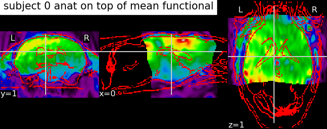

====================
Spatial registration
====================

.. contents:: **Contents**
    :local:
    :depth: 1

Why small-animal registration is challenging ? 
==============================================

    There is no standard procedure for registering fMRI data into common space in rodent and other small-mammals fMRI studies. Straightforward application of human image registration procedures to animal studies is unfeasible. Indeed, image-registration based on signal intensity is biased towards the sensitivity profile of the surface coil usually used for signal reception in small animal MRI. Moreover, the accuracy of image registration is compromised by the high tissue volume outside the brain.

sammba-MRI strategy
===================

Per-sclice registration

Results
=======

   functional to anatomical coregistration

.. figure:: images/coregistration_subject_anat_to_template.png
   :scale: 50
   :align: center
   :alt: template edges on top of functional

   functional to template coregistration

